### Backend Engineer | Cloud & MLOps
  
_Focused on building high-performance, scalable backend systems and MLOps pipelines._

_Creator of the [Nexus](https://github.com/DannyahIA/nexus) real-time chat._

### My philosophy is to use the right tool for the job, with a special focus on performance and scalability.

## 🤝 Let's Connect

I'm always open to new challenges and collaborations.

   

    

    

---

### � About This README

This profile is automatically updated every hour using **GitHub Actions**.  
All visualizations are generated as interactive SVG components using Python.

**Technologies:** Python • SVG • GitHub API • GitHub Actions • JSON

 

 📅 Last Update: <!-- AUTO-GENERATED:START (last_update) -->2026-02-11 19:14:02 UTC<!-- AUTO-GENERATED:END -->_  
_🤖 Generated by [profile-automation](https://github.com/DannyahIA/profile-automation)_

